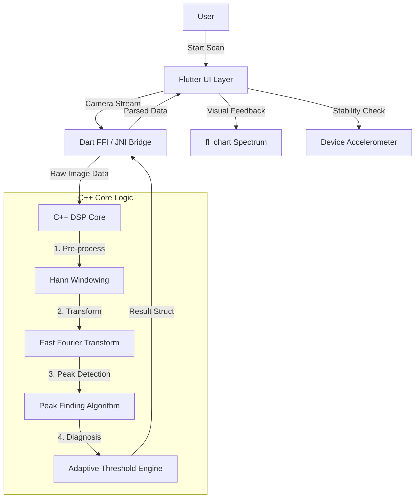

# Technical Architecture 🏗️

This document outlines the high-level architecture of **Vibravision**, a hybrid application combining a Flutter UI with a high-performance C++ DSP core.

## System Overview

The system is designed as a **Flutter-first** application for cross-platform UI, delegating computationally intensive tasks (Image Processing & FFT) to a **native C++ library** for maximum performance and real-time capability.

## detailed Implementation

### 1. UI Layer (Flutter)
- **`lib/main.dart`**: The entry point and main screen (`VisionScreen`).
- **State Management**: Uses `setState` for local UI updates (scanning status, results).
- **Camera Handling**: Uses the `camera` package to stream YUV420 frames.
- **Visualization**: Renders the frequency spectrum using `fl_chart`.

### 2. Native Bridge Layer
- **`services/native_bridge.dart`**: Handles communication between Dart and Native code.
- **Data Transfer**: Pass raw byte arrays (image data) from Dart to C++.
- **Result Marshalling**: Converts C++ structs (`DSPResult`) back into Dart objects.

### 3. Core Logic Layer (C++)
- **`dsp_core.h` / `dsp_core.cpp`**: The heart of the application.
- **`DSPCore::process`**:
    1.  **Signal Extraction**: Extracts luminance/motion data from the video frame.
    2.  **Windowing**: Applies a Hann window to reduce spectral leakage.
    3.  **FFT**: Computes the frequency spectrum.
    4.  **Harmonic Analysis**: Identifies peaks related to the **Target RPM**.
- **`AdaptiveThreshold`**: Contains the ruleset for diagnosing faults based on ISO standards and harmonic relationships (1X, 2X, etc.).

## Data Flow

1.  **Input**: Camera stream (30fps) + User Input (RPM).
2.  **Processing**: Frame-by-frame analysis in C++.
3.  **Output**: `HealthStatus` (Healthy/Warning/Critical), `FaultType` (Unbalance/Misalignment/Looseness), and Spectrum Data.
